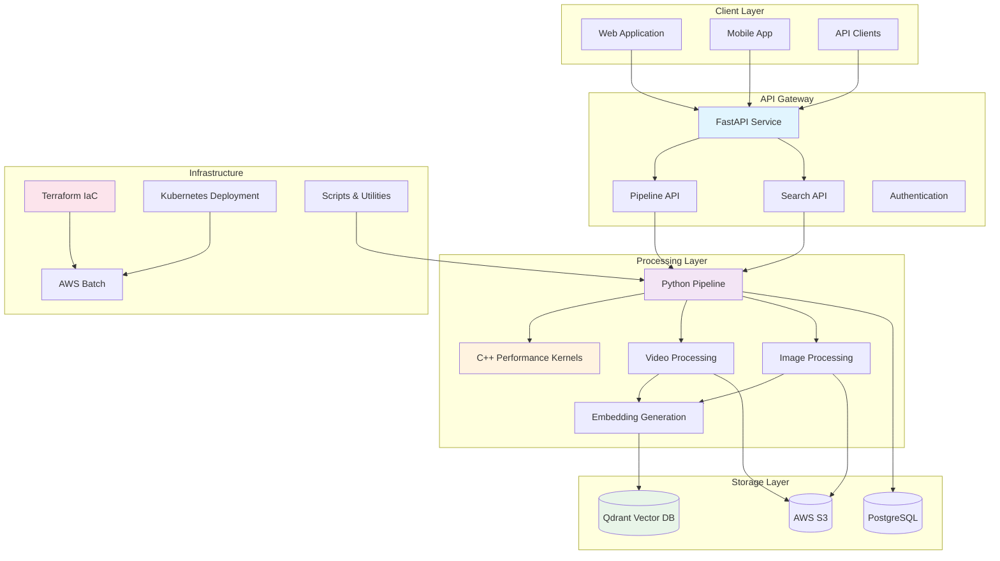

# Architecture Overview - Oriane Visual Extraction Pipeline

*Generated on: Tue Jul 15 08:30:35 AM CEST 2025*

## Executive Summary

The Oriane Visual Extraction Pipeline is a comprehensive, GPU-accelerated system for processing multimedia content and converting it into searchable embeddings. This document provides a detailed analysis of the system architecture, component inventory, and inter-component data flow.

## Component Inventory

### API Component

  - Status: ✅ Present
  - File counts:
    - Python files: 22312
    - C++ files: 17630
    - YAML files: 35
    - Markdown files: 47
    - Shell scripts: 27
    - JavaScript/TypeScript files: 6
  - Documentation:
    - pipeline/README.md
    - development/README.md
    - autograd/README.md
    - array_api_compat/README.md
    - array_api_extra/README.md
    - add_content/README.md
    - search/README.md
    - .pytest_cache/README.md
    - autograd/README.md
    - array_api_compat/README.md
    - array_api_extra/README.md
    - deploy/README.md
  - Entry points: 35 found

### Core Python Pipeline

  - Status: ✅ Present
  - File counts:
    - Python files: 11262
    - C++ files: 8973
    - YAML files: 6
    - Markdown files: 19
    - Shell scripts: 11
    - JavaScript/TypeScript files: 3
  - Documentation:
    - py/README.md
    - pipeline/README.md
    - autograd/README.md
    - array_api_compat/README.md
    - array_api_extra/README.md
    - test/README.md
  - Pipeline directory: ✅ Present

### Core C++ Kernels

  - Status: ✅ Present
  - File counts:
    - Python files: 1
    - C++ files: 5
    - YAML files: 2
    - Shell scripts: 7
    - JavaScript/TypeScript files: 2
  - Documentation: ❌ No README found
  - Build system: ✅ Present

### Qdrant Vector Database

  - Status: ✅ Present
  - File counts:
    - Python files: 11172
    - C++ files: 8812
    - YAML files: 9
    - Markdown files: 19
    - Shell scripts: 7
    - JavaScript/TypeScript files: 3
  - Documentation:
    - collections/README.md
    - extraction-legacy/README.md
    - autograd/README.md
    - array_api_compat/README.md
    - array_api_extra/README.md
    - tests/README.md
    - qdrant/README.md
    - search/README.md
    - keys/README.md

### Terraform Infrastructure

  - Status: ✅ Present
  - File counts:
    - Terraform files: 7
  - Documentation: ❌ No README found
  - Main configuration: ✅ Present

### Utility Scripts

  - Status: ✅ Present
  - File counts:
    - Python files: 3
    - Shell scripts: 23
  - Documentation: ❌ No README found

### Kubernetes Deployment

  - Status: ✅ Present
  - File counts:
    - YAML files: 1
  - Documentation: ❌ No README found
  - Deployment files: ✅ Present

## System Architecture Diagram



*Auto-generated diagram based on component analysis*

## Inter-Component Data Flow

### 1. Content Ingestion Flow
```
Client → API Gateway → Python Pipeline → C++ Kernels → Storage
```

**Process:**
1. **Client uploads** video/image content via REST API
2. **API Gateway** validates request and queues processing job
3. **Python Pipeline** orchestrates the processing workflow
4. **C++ Kernels** perform GPU-accelerated video processing
5. **Storage Layer** persists processed frames and embeddings

### 2. Search & Retrieval Flow
```
Client → Search API → Qdrant Vector DB → Results
```

**Process:**
1. **Client submits** text or image query
2. **Search API** converts query to embeddings
3. **Qdrant** performs similarity search
4. **Results** returned with metadata and file paths

### 3. Infrastructure Management Flow
```
Terraform → AWS Resources → Kubernetes → Application Deployment
```

**Process:**
1. **Terraform** provisions cloud infrastructure
2. **AWS Resources** provide compute and storage
3. **Kubernetes** orchestrates container deployment
4. **Scripts** manage maintenance and monitoring

### 4. Data Processing Pipeline
```
Raw Video → Border Detection → Frame Extraction → Embedding → Vector Storage
```

**Components involved:**
- **C++ Kernels**: GPU-accelerated video processing
- **Python Pipeline**: Scene detection and orchestration
- **CLIP Models**: Embedding generation
- **Qdrant**: Vector indexing and storage

## Missing Documentation

The following documentation files are missing or need attention:

- ❌ API component README
- ❌ Core C++ README
- ❌ Terraform README
- ❌ Kubernetes README
- ❌ Scripts README
- ❌ Contributing guidelines
- ❌ Deployment guide
- ❌ Troubleshooting guide
- ❌ API reference documentation

**Recommendation:** Create these documentation files to improve project maintainability.

## Component Summary Table

| Component | Status | Primary Language | Purpose |
|-----------|--------|------------------|---------|
| API | EXISTS | Python | REST API endpoints |
| Core/Python | EXISTS | Python | Processing pipeline |
| Core/C++ | EXISTS | C++ | Performance kernels |
| Qdrant | EXISTS | Python | Vector database |
| Terraform | EXISTS | HCL | Infrastructure as Code |
| Scripts | EXISTS | Shell/Python | Utilities |
| K8s | EXISTS | YAML | Container orchestration |

## Recommendations

### Architecture Improvements

1. **Documentation Enhancement**: Address missing documentation identified above
2. **Component Integration**: Ensure all components have proper integration tests
3. **Performance Monitoring**: Add metrics collection for each component
4. **Security Hardening**: Implement security best practices across all components
5. **Scalability Planning**: Design for horizontal scaling of processing components

---

*This document was automatically generated by the architecture inventory script.*
*Last updated: Tue Jul 15 08:30:39 AM CEST 2025*
