# Oriane Video Extraction Pipeline

[](https://www.python.org/downloads/)
[](https://www.postgresql.org/)
[](https://qdrant.tech/)

**Automated video content extraction pipeline that processes Instagram content from PostgreSQL database and generates searchable embeddings using the core video processing pipeline.**

This extraction script orchestrates the complete video processing workflow, from database querying to frame extraction, embedding generation, and vector storage. It processes millions of records in batches with robust checkpoint/resume functionality and error handling.

---

## 🚀 Quick Start

### Prerequisites

- **Python 3.10+** with virtual environment support
- **PostgreSQL** database access with `OrianeAdmin` database
- **Core Pipeline** virtual environment at `../../../core/py/pipeline/.venv`
- **Environment files** properly configured

### 🎯 Which Script Should You Use?

| Feature                     | `run_simple.sh`      | `run.sh`                            |
| --------------------------- | -------------------- | ----------------------------------- |
| **Complexity**              | Simple ✅            | Advanced 🔧                         |
| **Checkpoint Management**   | None                 | JSON/Database                       |
| **Database State Tracking** | No                   | Yes (`is_extracted`, `is_embedded`) |
| **Parallel Processing**     | Configurable workers | Single-threaded                     |
| **Resume Capability**       | No                   | Yes                                 |
| **Error Handling**          | Basic                | Comprehensive                       |
| **Logging**                 | Console output       | File + Console                      |
| **Best For**                | Regular processing   | Production with tracking            |

**For most users: `run_simple.sh`** ✅

- Simple, fast, and reliable
- Processes videos in parallel with configurable workers
- No complex checkpoint management
- Perfect for regular processing tasks

**For advanced users: `run.sh`** 🔧

- Full-featured with checkpoint management
- Database state tracking (`is_extracted`, `is_embedded`)
- Comprehensive error handling and logging
- Resume capability from interruptions

### ⚡ Quick Start (Simple Processor)

```bash
# 1. Navigate to the extraction directory
cd /home/quantium/labs/oriane/ExtractionPipeline/qdrant/extraction-legacy

# 2. Set up the environment (one-time setup)
python3 setup_env.py

# 3. Create and configure environment file
cp .env.sample .env
nano .env  # Add your database credentials

# 4. Run the simple processor
./run_simple.sh
```

### ⚡ Running the Extraction Pipeline

```bash
# Navigate to the extraction directory
cd /home/quantium/labs/oriane/ExtractionPipeline/qdrant/extraction-legacy

# 🚀 RECOMMENDED: Run the simple extraction pipeline
./run_simple.sh

# Or with options
./run_simple.sh --batch-size 500    # Process 500 records per batch
./run_simple.sh --max-workers 4     # Use 4 parallel workers

# 🔧 ADVANCED: Run the full extraction pipeline with all features
./run.sh

# Or with advanced options
./run.sh --batch-size 500    # Process 500 records per batch
./run.sh --json-checkpoint   # Use JSON file for checkpoints
./run.sh --db-checkpoint     # Use database table for checkpoints
./run.sh --verbose           # Enable verbose logging
./run.sh --dry-run           # Validate setup without running
```

---

## 📋 Table of Contents

1. [Architecture Overview](#🏗️-architecture-overview)
2. [Database Schema](#📊-database-schema)
3. [Installation & Setup](#🔧-installation--setup)
4. [Environment Configuration](#🌐-environment-configuration)
5. [Usage Examples](#📖-usage-examples)
6. [Checkpoint Management](#💾-checkpoint-management)
7. [Error Handling](#🛡️-error-handling)
8. [Monitoring & Logging](#📊-monitoring--logging)
9. [Troubleshooting](#🔧-troubleshooting)
10. [Development Guide](#👨‍💻-development-guide)

---

## 🏗️ Architecture Overview

```mermaid
graph TD
    A[🚀 Start Extraction] --> B[📦 Load Checkpoint]
    B --> C[🔍 Query Database Batch]
    C --> D{📋 Records Available?}
    D -->|No| E[🏁 Complete]
    D -->|Yes| F[📝 Process Batch]
    F --> G[🎬 Video Extraction]
    G --> H{✅ Extraction Success?}
    H -->|No| I[❌ Log Error]
    H -->|Yes| J[✅ Mark as Extracted]
    J --> K[🖼️ Frame Embedding]
    K --> L{🔍 Embedding Success?}
    L -->|No| M[⚠️ Log Warning]
    L -->|Yes| N[✅ Mark as Embedded]
    I --> O[💾 Save Checkpoint]
    M --> O
    N --> O
    O --> P[⏱️ Sleep Delay]
    P --> C

    style A fill:#e1f5fe
    style E fill:#e8f5e8
    style I fill:#ffebee
    style M fill:#fff3e0
    style J fill:#e8f5e8
    style N fill:#e8f5e8
```



### Processing Flow

#### Simple Processor Flow

1. **Database Query**: Fetch Instagram codes ordered by publish_date (newest first)
2. **Parallel Processing**: Process videos in configurable batches with multiple workers
3. **Core Pipeline Execution**: Run video extraction through the core pipeline
4. **No State Tracking**: Process all videos without updating database flags

#### Full Pipeline Flow

1. **Database Query**: Fetch unprocessed content in configurable batches
2. **Video Processing**: Execute core pipeline for cropping and frame extraction
3. **Database Updates**: Mark successful extractions in PostgreSQL
4. **Embedding Generation**: Process extracted frames through CLIP models
5. **Vector Storage**: Store embeddings in Qdrant vector database
6. **Checkpoint Management**: Track progress for resumable processing

---

## 📊 Database Schema

### Primary Table: `insta_content`

```sql
CREATE TABLE insta_content (
    id SERIAL PRIMARY KEY,
    platform VARCHAR(50) NOT NULL DEFAULT 'instagram',
    code VARCHAR(255) NOT NULL UNIQUE,
    is_downloaded BOOLEAN DEFAULT FALSE,
    is_extracted BOOLEAN DEFAULT FALSE,
    is_embedded BOOLEAN DEFAULT FALSE,
    created_at TIMESTAMP DEFAULT CURRENT_TIMESTAMP,
    updated_at TIMESTAMP DEFAULT CURRENT_TIMESTAMP
);

-- Indexes for performance
CREATE INDEX idx_insta_content_extraction
ON insta_content(id, is_downloaded, is_extracted, is_embedded);
```

### Checkpoint Table: `extraction_checkpoints`

```sql
CREATE TABLE extraction_checkpoints (
    id SERIAL PRIMARY KEY,
    pipeline_name VARCHAR(100) NOT NULL UNIQUE,
    last_processed_id INTEGER NOT NULL,
    total_processed INTEGER DEFAULT 0,
    created_at TIMESTAMP DEFAULT CURRENT_TIMESTAMP,
    updated_at TIMESTAMP DEFAULT CURRENT_TIMESTAMP
);
```

### Processing States

| Field           | Description                           | Values          |
| --------------- | ------------------------------------- | --------------- |
| `is_downloaded` | Content downloaded from S3            | `true`, `false` |
| `is_extracted`  | Video processed and frames extracted  | `true`, `false` |
| `is_embedded`   | Frame embeddings generated and stored | `true`, `false` |

---

## 🔧 Installation & Setup

### System Requirements

```bash
# Python 3.10+
python3 --version

# PostgreSQL client
sudo apt install postgresql-client

# Core pipeline dependencies (should already be installed)
ls -la ../../../core/py/pipeline/.venv/
```

### Environment Setup

```bash
# Navigate to extraction directory
cd /home/quantium/labs/oriane/ExtractionPipeline/qdrant/extraction-legacy

# Set up virtual environment (required for both scripts)
python3 setup_env.py

# Create environment file from template
cp .env.sample .env
nano .env  # Edit with your database credentials
```

### Dependencies

The extraction pipeline requires:

```txt
psycopg2-binary>=2.9.0
python-dotenv>=1.0.0
```

---

## 🌐 Environment Configuration

### Required Environment Variables

Create a `.env` file with the following configuration:

```bash
# PostgreSQL Database Configuration
DB_HOST=your-database-host.amazonaws.com
DB_PORT=5432
DB_USER=your-username
DB_PASSWORD=your-secure-password
DB_NAME=OrianeAdmin

# Optional: Processing Configuration
BATCH_SIZE=1000              # Records per batch (default: 1000)
CHECKPOINT_MODE=json         # json|database (default: json)
SLEEP_DELAY=0.1             # Delay between batches in seconds
TIMEOUT_SECONDS=600         # Subprocess timeout (default: 600)

# Optional: Logging Configuration
LOG_LEVEL=INFO              # DEBUG|INFO|WARNING|ERROR
LOG_FILE=logs/extraction.log
```

### Core Pipeline Dependencies

The extraction script relies on the core video processing pipeline:

- **Virtual Environment**: `../../../core/py/pipeline/.venv/`
- **Entry Point**: `../../../core/py/pipeline/entrypoint.py`
- **Configuration**: `../../../core/py/pipeline/.env`

---

## 📖 Usage Examples

### Simple Processor (Recommended)

```bash
# Run with default settings (1000 records per batch, 8 workers)
./run_simple.sh

# Customize batch size and workers
./run_simple.sh --batch-size 500 --max-workers 4

# Process with minimal resources
./run_simple.sh --batch-size 100 --max-workers 2

# High-performance processing
./run_simple.sh --batch-size 2000 --max-workers 16
```

### Full Pipeline (Advanced)

```bash
# Run with default settings (1000 records per batch, JSON checkpoints)
./run.sh

# Resume from previous checkpoint
./run.sh  # Automatically resumes from last processed ID
```

### Advanced Options

#### Simple Processor Options

```bash
# Custom batch size for memory optimization
./run_simple.sh --batch-size 500

# Adjust parallel processing workers
./run_simple.sh --max-workers 4

# High-throughput processing
./run_simple.sh --batch-size 2000 --max-workers 16
```

#### Full Pipeline Options

```bash
# Custom batch size for memory optimization
./run.sh --batch-size 500

# Use database checkpoints instead of JSON file
./run.sh --db-checkpoint

# Verbose logging for debugging
./run.sh --verbose

# Validate environment without processing
./run.sh --dry-run
```

### Manual Execution

```bash
# Direct Python execution
python main.py

# With environment variables
BATCH_SIZE=500 CHECKPOINT_MODE=database python main.py
```

### Database Monitoring

```sql
-- Check processing progress
SELECT
    COUNT(*) as total_records,
    COUNT(*) FILTER (WHERE is_downloaded = true) as downloaded,
    COUNT(*) FILTER (WHERE is_extracted = true) as extracted,
    COUNT(*) FILTER (WHERE is_embedded = true) as embedded
FROM insta_content;

-- View recent processing activity
SELECT id, code, is_extracted, is_embedded, updated_at
FROM insta_content
WHERE updated_at > NOW() - INTERVAL '1 hour'
ORDER BY updated_at DESC
LIMIT 20;

-- Check checkpoint status
SELECT * FROM extraction_checkpoints
WHERE pipeline_name = 'video_extraction';
```

---

## 💾 Checkpoint Management

The extraction pipeline supports two checkpoint storage methods:

### JSON File Checkpoints (Default)

```python
# Stored in: checkpoint.json
{
    "pipeline_name": "video_extraction",
    "last_processed_id": 12345,
    "total_processed": 12000,
    "updated_at": "2024-01-15T10:30:00Z"
}
```

**Advantages:**

- Simple and fast
- No database dependencies
- Easy to backup and restore

### Database Checkpoints

```sql
-- Stored in: extraction_checkpoints table
INSERT INTO extraction_checkpoints (
    pipeline_name,
    last_processed_id,
    total_processed
) VALUES (
    'video_extraction',
    12345,
    12000
) ON CONFLICT (pipeline_name)
DO UPDATE SET
    last_processed_id = EXCLUDED.last_processed_id,
    total_processed = EXCLUDED.total_processed,
    updated_at = CURRENT_TIMESTAMP;
```

**Advantages:**

- Centralized tracking
- Multi-instance coordination
- Historical audit trail

### Checkpoint Operations

```bash
# View current checkpoint
python -c "from checkpoint_manager import CheckpointManager; print(CheckpointManager().get_checkpoint())"

# Reset checkpoint (start from beginning)
python -c "from checkpoint_manager import CheckpointManager; CheckpointManager().update_checkpoint(0)"

# Backup checkpoint
cp checkpoint.json checkpoint_backup_$(date +%Y%m%d_%H%M%S).json
```

---

## 🛡️ Error Handling

### Processing Errors

The pipeline handles various error scenarios gracefully:

#### Video Processing Failures

```python
# Individual record failures don't stop the batch
try:
    success = self._process_video_extraction(record)
    if success:
        successful_extractions.append(record.id)
except Exception as e:
    print(f"Error processing record {record.id}: {e}")
    # Continue with next record
```

#### Timeout Handling

```python
# 10-minute timeout for video processing
result = subprocess.run(
    [python_path, entrypoint_path],
    env=env,
    capture_output=True,
    text=True,
    timeout=600  # 10 minutes
)
```

#### Database Connection Issues

```python
# Automatic reconnection and retry logic
try:
    batch = next_batch(size=self.batch_size, last_id=last_processed_id)
except psycopg2.OperationalError as e:
    print(f"Database connection error: {e}")
    # Retry with exponential backoff
```

### Signal Handling

The pipeline supports graceful shutdown:

```python
# Handle Ctrl+C and SIGTERM
signal.signal(signal.SIGINT, self._signal_handler)
signal.signal(signal.SIGTERM, self._signal_handler)

def _signal_handler(self, signum, frame):
    print(f"Received signal {signum}. Shutting down gracefully...")
    self.should_stop = True
```

---

## 📊 Monitoring & Logging

### Log Levels and Output

```python
# Configure logging verbosity
import logging

# Available levels: DEBUG, INFO, WARNING, ERROR
logging.basicConfig(
    level=logging.INFO,
    format='%(asctime)s - %(levelname)s - %(message)s',
    handlers=[
        logging.FileHandler('logs/extraction.log'),
        logging.StreamHandler()
    ]
)
```

### Progress Tracking

```bash
# Real-time progress monitoring
tail -f logs/extraction.log

# Processing statistics
grep "Marked.*records as extracted" logs/extraction.log | tail -10
grep "Updated checkpoint" logs/extraction.log | tail -5

# Error monitoring
grep "Error processing record" logs/extraction.log | tail -20
```

### Performance Metrics

```sql
-- Processing rate analysis
WITH processing_stats AS (
    SELECT
        DATE_TRUNC('hour', updated_at) as hour,
        COUNT(*) as records_processed
    FROM insta_content
    WHERE is_extracted = true
    AND updated_at > NOW() - INTERVAL '24 hours'
    GROUP BY DATE_TRUNC('hour', updated_at)
    ORDER BY hour
)
SELECT
    hour,
    records_processed,
    LAG(records_processed) OVER (ORDER BY hour) as prev_hour,
    records_processed - LAG(records_processed) OVER (ORDER BY hour) as hourly_rate
FROM processing_stats;
```

### System Resource Monitoring

```bash
# Monitor CPU and memory usage
top -p $(pgrep -f "python.*main.py")

# Monitor disk space (for frame storage)
df -h /home/quantium/labs/oriane/ExtractionPipeline/core/py/pipeline/.output/

# Monitor database connections
psql -h $DB_HOST -U $DB_USER -d $DB_NAME -c "SELECT count(*) FROM pg_stat_activity WHERE state = 'active';"
```

---

## 🔧 Troubleshooting

### Common Issues

#### Simple Processor Issues

```bash
# Virtual environment not found
python3 setup_env.py

# Check if virtual environment is properly set up
ls -la .venv/bin/python

# Test simple processor directly
python3 simple_processor.py --batch-size 1 --max-workers 1
```

#### Pipeline Fails to Start

```bash
# Check Python environment
which python3
python3 --version

# Verify core pipeline virtual environment
ls -la ../../../core/py/pipeline/.venv/bin/python

# Test database connection
psql -h $DB_HOST -U $DB_USER -d $DB_NAME -c "SELECT 1;"
```

#### Video Processing Timeouts

```bash
# Increase timeout in environment
export TIMEOUT_SECONDS=1200  # 20 minutes

# Reduce batch size
export BATCH_SIZE=100

# Check available disk space
df -h /tmp/
```

#### Memory Issues

```bash
# Monitor memory usage
free -h
ps aux | grep python | head -20

# Reduce batch size
./run.sh --batch-size 100

# Clear temporary files
rm -rf ../../../core/py/pipeline/.output/tmp/*
```

#### Database Performance

```sql
-- Check for long-running queries
SELECT pid, now() - pg_stat_activity.query_start AS duration, query
FROM pg_stat_activity
WHERE (now() - pg_stat_activity.query_start) > interval '5 minutes';

-- Analyze table statistics
ANALYZE insta_content;

-- Check index usage
SELECT schemaname, tablename, attname, n_distinct, correlation
FROM pg_stats
WHERE tablename = 'insta_content';
```

### Debug Mode

```bash
# Enable debug logging
LOG_LEVEL=DEBUG ./run.sh --verbose

# Test single record processing
python -c "
from db import next_batch
from main import ExtractionPipeline
batch = next_batch(size=1, last_id=0)
if batch:
    pipeline = ExtractionPipeline()
    result = pipeline._process_video_extraction(batch[0])
    print(f'Result: {result}')
"
```

### Performance Optimization

#### Database Optimization

```sql
-- Create additional indexes for performance
CREATE INDEX CONCURRENTLY idx_insta_content_unextracted
ON insta_content(id)
WHERE is_downloaded = true AND is_extracted = false;

CREATE INDEX CONCURRENTLY idx_insta_content_unembedded
ON insta_content(id)
WHERE is_extracted = true AND is_embedded = false;
```

#### Batch Size Tuning

```bash
# Start with small batches for testing
./run.sh --batch-size 10

# Gradually increase based on system performance
./run.sh --batch-size 100   # Test performance
./run.sh --batch-size 500   # Scale up
./run.sh --batch-size 1000  # Production rate
```

---

## 👨‍💻 Development Guide

### Project Structure

```
qdrant/scripts/extract/
├── main.py                    # Main extraction pipeline orchestrator
├── checkpoint_manager.py     # Checkpoint storage and retrieval
├── db.py                     # Database operations and queries
├── models.py                 # Data models and types
├── logger.py                 # Logging configuration
├── requirements.txt          # Python dependencies
├── .env                      # Environment configuration
├── .env.sample              # Environment template
├── run.sh                   # Main execution script
├── README.md                # This documentation
├── logs/                    # Log file directory
├── tests/                   # Test suite
│   ├── test_extraction.py   # Integration tests
│   ├── test_checkpoint.py   # Checkpoint tests
│   └── README.md            # Test documentation
└── CHECKPOINT_README.md     # Checkpoint management guide
```

### Core Components

#### 1. ExtractionPipeline (`main.py`)

Main orchestrator class that coordinates the entire extraction process.

```python
class ExtractionPipeline:
    def __init__(self, batch_size: int = 1000, use_json_checkpoint: bool = True):
        # Initialize with configurable batch size and checkpoint method

    def run(self):
        # Main processing loop with checkpoint/resume capability

    def _process_video_extraction(self, record: InstaContent) -> bool:
        # Execute core pipeline for video processing

    def _process_frame_embedding(self, record: InstaContent) -> bool:
        # Handle frame embedding generation
```

#### 2. CheckpointManager (`checkpoint_manager.py`)

Handles checkpoint storage and retrieval with multiple backend options.

```python
class CheckpointManager:
    def __init__(self, use_json: bool = True):
        # Configure checkpoint storage method

    def get_checkpoint(self) -> Optional[int]:
        # Retrieve last processed ID

    def update_checkpoint(self, last_processed_id: int):
        # Update checkpoint with new progress
```

#### 3. Database Operations (`db.py`)

Handles all PostgreSQL operations with connection pooling and error handling.

```python
def next_batch(size: int = 1000, last_id: Optional[int] = None) -> List[InstaContent]:
    # Fetch next batch of unprocessed records

def mark_extracted(record_ids: List[int]) -> None:
    # Mark records as successfully extracted

def mark_embedded(record_ids: List[int]) -> None:
    # Mark records as successfully embedded
```

### Testing

```bash
# Run all tests
cd tests/
python -m pytest -v

# Run specific test categories
python -m pytest test_extraction.py -v
python -m pytest test_checkpoint.py -v

# Run with coverage
python -m pytest --cov=../ --cov-report=html
```

### Development Workflow

1. **Setup Development Environment**

   ```bash
   # Create development branch
   git checkout -b feature/extraction-improvements

   # Setup environment
   cp .env.sample .env.dev
   # Edit .env.dev with development database
   ```

2. **Make Changes**

   ```bash
   # Edit code
   nano main.py

   # Test changes
   ./run.sh --dry-run --verbose
   ```

3. **Testing**

   ```bash
   # Unit tests
   cd tests/
   python -m pytest -v

   # Integration test with small batch
   BATCH_SIZE=5 python ../main.py
   ```

4. **Code Quality**

   ```bash
   # Format code
   black *.py

   # Type checking
   mypy *.py

   # Linting
   pylint *.py
   ```

### Adding New Features

#### Example: Adding Retry Logic

```python
import time
import random

def _process_video_extraction_with_retry(self, record: InstaContent, max_retries: int = 3) -> bool:
    """Process video extraction with exponential backoff retry."""
    for attempt in range(max_retries):
        try:
            return self._process_video_extraction(record)
        except Exception as e:
            if attempt < max_retries - 1:
                delay = (2 ** attempt) + random.uniform(0, 1)
                print(f"Attempt {attempt + 1} failed for record {record.id}, retrying in {delay:.2f}s...")
                time.sleep(delay)
            else:
                print(f"All {max_retries} attempts failed for record {record.id}")
                raise e
    return False
```

---

## 🔗 Related Documentation

- **[Checkpoint Management Guide](CHECKPOINT_README.md)** - Detailed checkpoint system documentation
- **[Logging Guide](LOGGING_README.md)** - Comprehensive logging configuration
- **[Test Documentation](tests/README.md)** - Testing strategy and test execution
- **[Core Pipeline Documentation](../../../core/py/pipeline/README.md)** - Video processing pipeline details

---

## 📞 Support & Troubleshooting

### Getting Help

1. **Check Logs**: Always start by examining the log files
2. **Review Documentation**: This README and related guides
3. **Test Environment**: Use `--dry-run` to validate setup
4. **Database Health**: Verify database connectivity and performance

### Common Solutions

| Problem               | Solution                                            |
| --------------------- | --------------------------------------------------- |
| Pipeline won't start  | Check environment variables and core pipeline .venv |
| Slow processing       | Reduce batch size, check system resources           |
| Database timeouts     | Optimize queries, check connection pool             |
| Memory issues         | Lower batch size, clear temporary files             |
| Checkpoint corruption | Reset checkpoint, restart from known good ID        |

### Emergency Recovery

```bash
# Stop all processing
pkill -f "python.*main.py"

# Check system resources
df -h  # Disk space
free -h  # Memory
top  # CPU usage

# Reset to known good state
cp checkpoint_backup_20240101_120000.json checkpoint.json

# Restart with minimal batch size
BATCH_SIZE=10 ./run.sh --verbose
```

---

**© 2024 Oriane Labs – Automated video content extraction and embedding generation pipeline**
